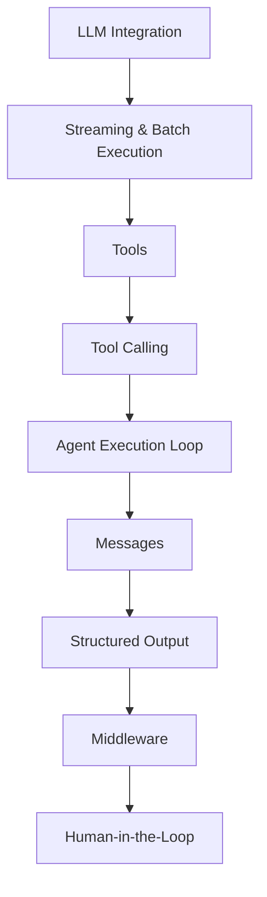

# Agentic AI with LangChain

## Overview

This repository documents my hands-on learning and implementation of Agentic AI concepts, primarily through LangChain. It covers the core building blocks of AI agents — from LLM integration and tool calling to structured output and middleware — along with one basic agent and tool-execution loop implemented in pure Python to understand the underlying mechanics before relying on a framework.

This is a learning and experimentation repository, not a production system. It reflects an ongoing, structured progression through Agentic AI fundamentals.

## Learning Roadmap



## Repository Structure

```
Agentic_AI/
│
├── langchain/
│   ├── 1-langchain_int...      # LangChain introduction / fundamentals
│   ├── 2-model_integr...       # Model integration (OpenAI, Groq, Gemini)
│   ├── 3-tools.ipynb           # Tools and tool definitions
│   ├── 4-messages.ipy...       # LangChain message types
│   ├── 5-structured_o...       # Structured output (Pydantic, TypedDict, dataclasses)
│   └── 6-middleware...         # Middleware, including summarization
│
├── nb_code.py
├── nb_code2.py
├── nb_code3.py
├── main.py
├── pyproject.toml
├── requirements.txt
└── uv.lock
```

> Note: Some filenames above are truncated in the source explorer view. Replace the placeholders with exact filenames once confirmed.

### Notebooks

| Notebook | Purpose | Key Concepts |
|---|---|---|
| `1-langchain_int...` | Introduction to LangChain fundamentals | Core LangChain concepts and setup |
| `2-model_integr...` | Integrating LLM providers | OpenAI, Groq, Gemini model integration |
| `3-tools.ipynb` | Defining and using tools | Tool creation, tool schemas |
| `4-messages.ipy...` | Working with conversation state | SystemMessage, HumanMessage, AIMessage, ToolMessage |
| `5-structured_o...` | Getting structured, validated output from models | Pydantic, TypedDict, dataclasses, nested schemas |
| `6-middleware...` | Agent pipeline middleware | Summarization middleware, human-in-the-loop middleware |

### Other Files

- **`main.py`** — Entry point for running implementations from this repository.
- **`nb_code.py`, `nb_code2.py`, `nb_code3.py`** — Supporting Python scripts extracted or adapted from the notebooks.
- **`pyproject.toml`, `requirements.txt`, `uv.lock`** — Project dependencies and environment configuration (managed with `uv`).

## Key Concepts

### LLM Integration
Integration with multiple LLM providers — OpenAI, Groq, and Gemini — through LangChain, covering how each is configured and invoked.

### Streaming & Batch
Implemented both streaming and batch execution patterns for model responses using LangChain.

### Tools & Tool Calling

Conceptual flow followed throughout this repository:

```
User → Model → Tool Call → Tool Execution → Tool Result → Model → Final Response
```

Covers defining tools, how models decide to call them, and how results are returned to the model for a final response — implemented using LangChain's tool-calling support.

### Agent From Scratch

One basic AI agent and one custom tool, including the tool-calling and tool-execution loop, were implemented in **pure Python, without a framework**. The goal was to understand the underlying mechanism — how a model's tool-call decision is parsed, how the corresponding function is executed, and how the result is fed back into the conversation — before relying on LangChain's abstractions for the rest of the work in this repository.

### LangChain Messages

Covers the core message types used to represent agent conversation state:

- **SystemMessage** — sets instructions/context for the model
- **HumanMessage** — represents user input
- **AIMessage** — represents model output
- **ToolMessage** — represents the result of a tool execution

### Structured Output

Covers generating and validating structured output from models, including:

- **Pydantic** models, including **nested structured schemas**
- **TypedDict**
- **Dataclasses**
- Comparing raw model output against parsed, structured output

### Middleware

Covers middleware components in an agent pipeline, including:

- **Summarization middleware**, with three trigger types:
  - Message-based trigger
  - Token-based trigger
  - Fraction-based trigger
- **Human-in-the-loop middleware**, for introducing manual checkpoints into agent execution

## Technologies

- Python
- LangChain
- OpenAI
- Groq
- Gemini
- Pydantic
- Jupyter Notebooks
- uv (dependency/environment management)

## Learning Philosophy

The focus of this repository is not just calling an agent framework, but understanding what it abstracts away. Implementing one basic agent and tool-execution loop from scratch in pure Python — before working through the equivalent concepts in LangChain — was intended to build a clearer picture of the underlying mechanism: message flow, tool-call parsing, and execution control. The rest of the concepts in this repository were learned and implemented using LangChain.

## Current Status

This is an active, ongoing learning repository. Notebooks and scripts are being added incrementally as new concepts are studied. It is not a production system.

## Future Learning

Areas planned for future exploration (not yet implemented in this repository):

- LangGraph
- Agent state and persistence
- Agent evaluation
- Observability
- Production deployment considerations

## Getting Started

1. Clone the repository.
2. Ensure Python is installed at the version specified in `.python-version`.
3. Install dependencies using `uv`:
   ```bash
   uv sync
   ```
   Alternatively, using `requirements.txt`:
   ```bash
   pip install -r requirements.txt
   ```
4. Configure the required API credentials (for OpenAI, Groq, and Gemini) as environment variables according to how they are referenced in the code.

### Security Note

- Never commit your `.env` file.
- Never expose API keys in code or commits.
- Ensure `.env` remains listed in `.gitignore`.
- Each user should create and use their own API credentials.

## Learning Outcomes

After going through this repository, one should be able to understand:

- How LLM providers are integrated and invoked through LangChain
- The difference between streaming and batch execution
- How tools are defined, called, and executed within an agent loop
- What a basic agent loop looks like when implemented without a framework
- How LangChain represents conversation state through message types
- How to generate and validate structured output using Pydantic, TypedDict, and dataclasses
- The role of middleware in an agent pipeline, including summarization and human-in-the-loop patterns

## Author

**Haseeb Tariq**
BS Information Technology
Machine Learning & Generative AI

- LinkedIn: https://www.linkedin.com/in/haseeb-tariq-0x
- GitHub: [[add link](https://github.com/haseeb-ml-engineer/agentic-ai-with-langchain.git)]

## License

No license has been added to this repository yet. Licensing can be added at a later stage.
